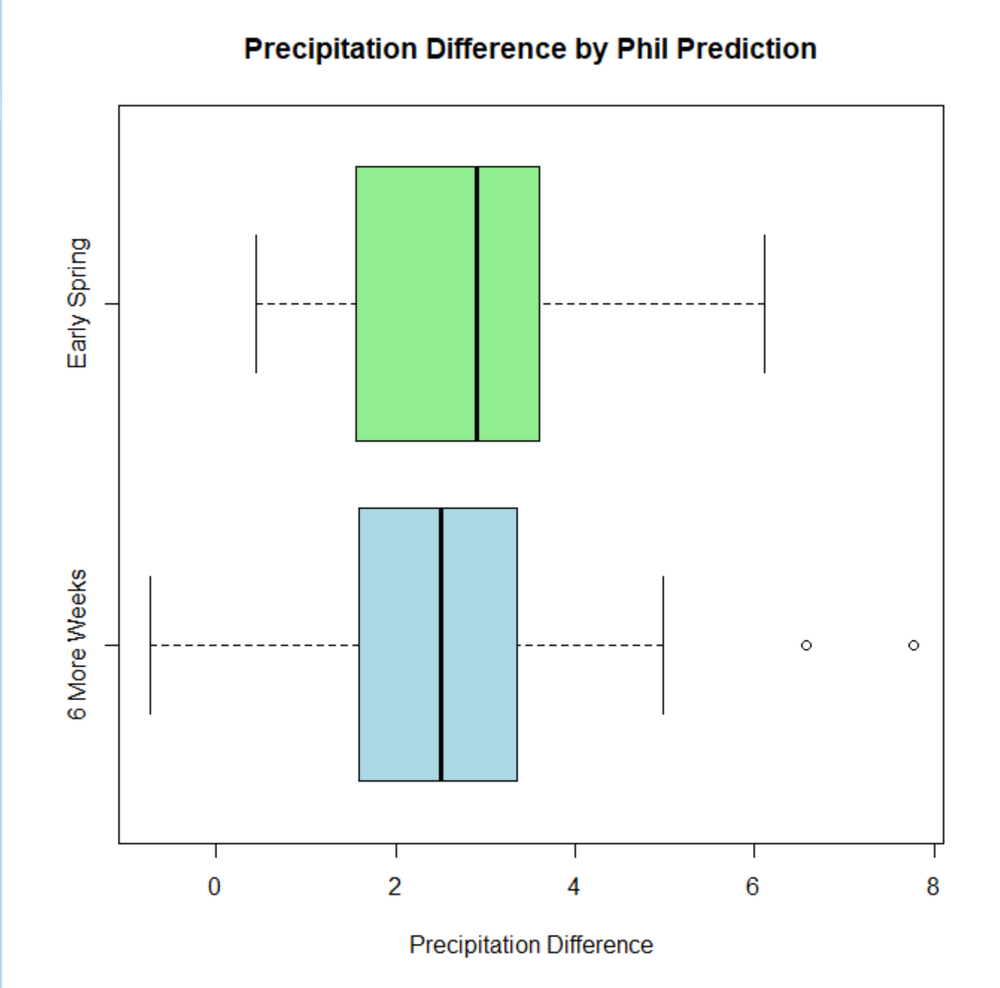

# Groundhog Day Project

This repository contains a Groundhog Day weather dataset and supporting files used for a statistics project at Duquesne University.

## Data

The repository includes two CSV files:

- `groundhog_pittsburgh_weather.csv`  
  Includes the computed **Percip Diff** column.

- `groundhog_pittsburgh_weather copy.csv`  
  Does not include the computed **Percip Diff** column.

### Percip Diff Definition

**Percip Diff** is defined as:

Rainfall Total - (Snowfall Total / 10)

This uses a 10:1 snowfall-to-water approximation to combine rainfall and snowfall into a single metric.

## Project Use

I used this dataset to perform a statistical analysis of whether Punxsutawney Phil's prediction is associated with different weather outcomes in Pittsburgh during the six weeks after Groundhog Day.

The main variable used in the analysis was **Percip Diff**, which was analyzed with a two-sample t-test.

## Box Plot of Percipitation Difference

## Reuse

You are free to use the data in this repository. As stated in the license, all files are open source and provided without warranty.

## About

This repository was created for a statistics class project at Duquesne University. The data was collected from a groundhog prediction website and from weather data gathered using a custom Python script that queries a weather API.

## License

MIT License
